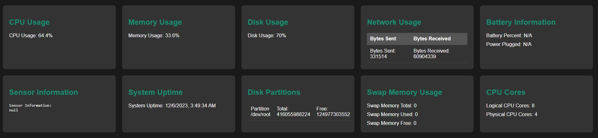

# FastAPI Health Service

This is a FastAPI application providing system health information. The app retrieves various system metrics and makes them accessible through an API.

## Live Demo

Check out the live demo of the FastAPI Health Service: [Live Demo](https://fast-api-health-service.onrender.com/)



## Instructions

To run the FastAPI Health Service locally or deploy it to your own environment, follow these instructions:

1. **Clone the Repository:**

   ```bash
   git clone https://github.com/your-username/fast-api-health-service.git
   cd fast-api-health-service

2. **Install Dependencies:**
    ```bash
    pip install -r requirements.txt

3. **Run the FastAPI App**:
    ``bash
    uvicorn app:app --reload

The app will be accessible at http://127.0.0.1:8000.
